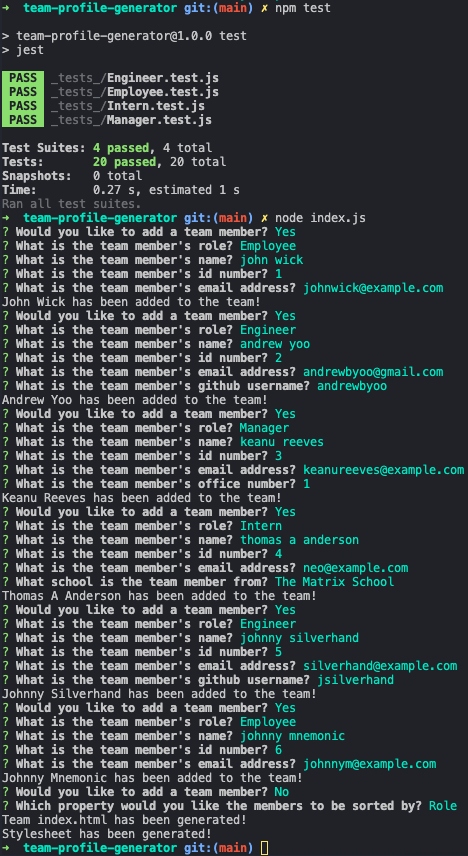

# Team Profile Generator
[](./LICENSE)
## Description
This app generates a style.css and index.html with any number of team members the user inputs. Leveraging node.js, the app creates new files, takes user prompts with inquirer, and can run test with jest.

## User Story
```
As a manager, I want to generate a webpage that displays my team's basic info so that I have quick access to their emails and GitHub profiles.
```

## Table of Contents
- [Installation](#installation)
- [Usage](#usage)
- [License](#license)
- [Features](#features)
- [Tests](#tests)
- [Questions](#questions)

## Installation
To get the app on your local machine:
Click on the code button on the repo.
Copy the HTTPS or SSH link.
Run the command `git clone` with the copied HTTPS or SSH link.
In your local repo, run the command `npm i`.

## Usage
The visual shows the program being tested, initiated, the prompt process, and output messages to inform the user that the results are ready. These are all the inputs used in the video demo linked below.



Please click [here](https://youtu.be/t50gq6LdWYI) for a video demo.

## License
This application is covered under the MIT license.

## Features
- Leverages jest to test the individual role.js files
- Leverages inquirer to prompt the user in a loop until all desired team members are added
- Sorts the team members by either Name, ID#, or Role in order of Manager, Engineer, Employee, then Intern
- Creates an index.html file and style.css file with the corresponding team members added

## Tests
In the terminal, the command `npm test` was run which ran through each file in the _test_ directory. The test files then passed set parameters through the corresponding js files in the lib directory to ensure that they were passing the desired outputs. Once the test passed, the command `node index.js` was run to initiate the program. The result of this test is the index.html and style.css committed in the dist directory using the responses shown in the screenshot.

## Questions
To view more of my projects, you can visit my GitHub page at [andrewbyoo](https://github.com/andrewbyoo).
If you have questions, email me at [andrewbyoo@gmail.com](mailto:andrewbyoo@gmail.com).
